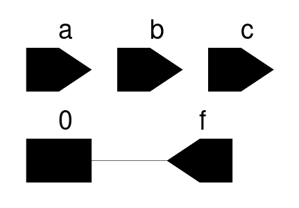

### 1.1 For the following SystemVerilog module, what is the simplified Boolean expression for the output?

```sv
module trueBoole
    (output logic f,
    input logic a, b, c);

    nor (f, f1, f2, f5);

    or  (f2, f3, f4, f5);
    not (f1, a);
    xor (f3, a, f1);
    and (f4, f3, c, a, b),
        (f5, a, c);
endmodule: trueBoole
```

Answer:

All possible combinations of following module:
```
Time=100 a=0 b=0 c=0 f=0
Time=200 a=0 b=0 c=1 f=0
Time=300 a=0 b=1 c=0 f=0
Time=400 a=0 b=1 c=1 f=0
Time=500 a=1 b=0 c=0 f=0
Time=600 a=1 b=0 c=1 f=0
Time=700 a=1 b=1 c=0 f=0
Time=800 a=1 b=1 c=1 f=0
```

Output is always 0 regardless of inputs `a, b, c` - `f`.

Therefore, original `trueBoole` can be simplified to:
```sv
module trueBoole
    (output logic f,
    input logic a, b, c);

    assign f = 0;
endmodule: trueBoole
```

The result of `Yosys` synthesis:

