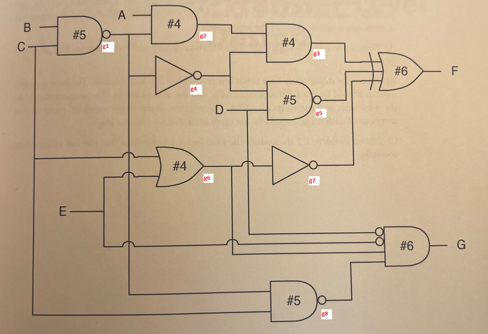
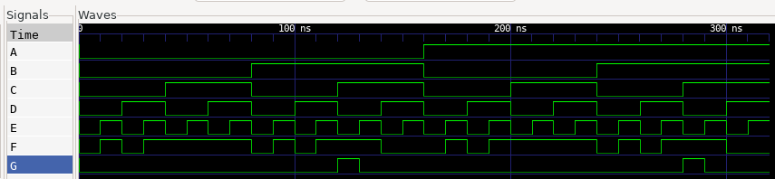

### 1.2 One of the functions of a testbench is to generate all possible input patterns (combination of 1s and 0s) for a combinational circuit that is being tested. Each pattern should be on the testbench output for #1 time unit. Write a testbench that will do this for a 4-input design-under-test. The header for your module is shown below. Imagine that outputs a-d are connected to the inputs of the design under test.

Source code:
```sv
module combinational_circuit
(
    input A, B, C, D, E,
    output F, G
);
    logic g1, g2, g3, g4, g5, g6, g7, g8;

    assign g1 = B ~& C;
    assign g2 = A & g1;
    assign g3 = g2 & g4;
    assign g4 = ~g1;
    assign g5 = g4 ~& D;
    assign g6 = C | E;
    assign g7 = ~g6;
    assign g8 = C ~& g1;
    
    assign F = g3 ^ g5 ^ g7;
    assign G = ~D & ~E & g6 & g8; 
endmodule: combinational_circuit
```

### 1.4 Extend your solution of Problem 1.2 to test Problem 1.3.

Gates description:


Simulation results:


Testbench:
```
Test 0: A=0 B=0 C=0 D=0 E=0 | F=0 G=0
Test 1: A=0 B=0 C=0 D=0 E=1 | F=1 G=0
Test 2: A=0 B=0 C=0 D=1 E=0 | F=0 G=0
Test 3: A=0 B=0 C=0 D=1 E=1 | F=1 G=0
Test 4: A=0 B=0 C=1 D=0 E=0 | F=1 G=0
Test 5: A=0 B=0 C=1 D=0 E=1 | F=1 G=0
Test 6: A=0 B=0 C=1 D=1 E=0 | F=1 G=0
Test 7: A=0 B=0 C=1 D=1 E=1 | F=1 G=0
Test 8: A=0 B=1 C=0 D=0 E=0 | F=0 G=0
Test 9: A=0 B=1 C=0 D=0 E=1 | F=1 G=0
Test10: A=0 B=1 C=0 D=1 E=0 | F=0 G=0
Test11: A=0 B=1 C=0 D=1 E=1 | F=1 G=0
Test12: A=0 B=1 C=1 D=0 E=0 | F=1 G=1
Test13: A=0 B=1 C=1 D=0 E=1 | F=1 G=0
Test14: A=0 B=1 C=1 D=1 E=0 | F=0 G=0
Test15: A=0 B=1 C=1 D=1 E=1 | F=0 G=0
Test16: A=1 B=0 C=0 D=0 E=0 | F=0 G=0
Test17: A=1 B=0 C=0 D=0 E=1 | F=1 G=0
Test18: A=1 B=0 C=0 D=1 E=0 | F=0 G=0
Test19: A=1 B=0 C=0 D=1 E=1 | F=1 G=0
Test20: A=1 B=0 C=1 D=0 E=0 | F=1 G=0
Test21: A=1 B=0 C=1 D=0 E=1 | F=1 G=0
Test22: A=1 B=0 C=1 D=1 E=0 | F=1 G=0
Test23: A=1 B=0 C=1 D=1 E=1 | F=1 G=0
Test24: A=1 B=1 C=0 D=0 E=0 | F=0 G=0
Test25: A=1 B=1 C=0 D=0 E=1 | F=1 G=0
Test26: A=1 B=1 C=0 D=1 E=0 | F=0 G=0
Test27: A=1 B=1 C=0 D=1 E=1 | F=1 G=0
Test28: A=1 B=1 C=1 D=0 E=0 | F=1 G=1
Test29: A=1 B=1 C=1 D=0 E=1 | F=1 G=0
Test30: A=1 B=1 C=1 D=1 E=0 | F=0 G=0
Test31: A=1 B=1 C=1 D=1 E=1 | F=0 G=0
```