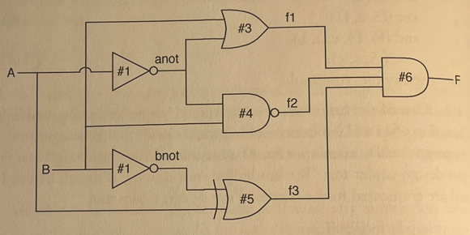

### 1.6 The following circuit is driven by the initial block shown.


```sv
logic A, B;
initial begin
A= 0;
B = 1;
#15 A=1;
B = 0;
#15 $finish;
end
```

> Draw a timing diagram for the circuit that starts at time 0 and continues until all signals
have settled to their final values.

### Answer
```
Time= 0 A=0 B=1 F=x
Time=11 A=0 B=1 F=0
Time=15 A=1 B=0 F=0
```

Combinational circuit is as follows:
```sv
module combinational_circuit
(
    input A, B,
    output F
);
    assign #1 a_not = ~A;
    assign #1 b_not = ~B;
    assign #3 f1 = B | a_not;
    assign #4 f2 = a_not ~& B;
    assign #5 f3 = b_not ^ A;
    assign #6 F = f1 & f2 & f3;
endmodule:combinational_circuit;
```

Test bench is as follows:
```sv
module combinational_circuit_tb;
    logic A, B, F;
    combinational_circuit dut(.*);
    initial begin
        $monitor("Time=%t A=%b B=%b F=%b", $time, A, B, F);
        A= 0;
        B = 1;
        #15 A=1;
        B = 0;
        #15 $finish;
    end
endmodule:combinational_circuit_tb;
```