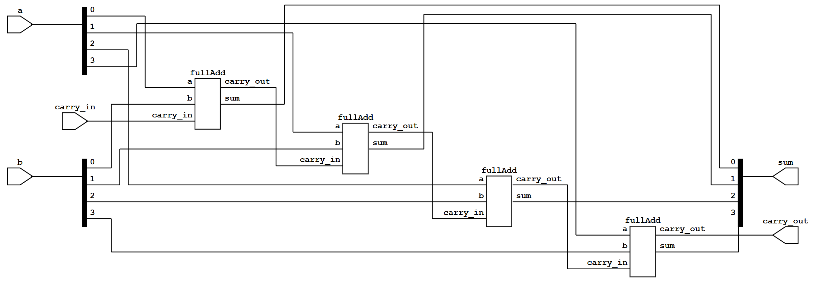
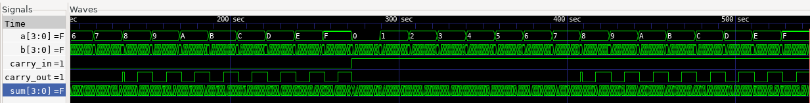

### 1.7 A full adder is a logic circuit that will add two binary input bits and a carry-in, and produce a sum and carry-out bit. The sum is the XOR of the three bits, and the carry-out is TRUE when two or more of the inputs are 1.
- A) Write a module called fullAdd with the three inputs and two outputs. Use primitive
gates.
- B) Instantiate this module four times inside a 4-bit full adder module. The inputs to this
module should be the 4-bit vectors a and b, and the scalar carryIn. The outputs should be
the 4-bit sum and the scalar carryOut. Connect the instantiated modules' ports so that
carry out of each stage connect to the carry in or the next higher stage.
- C) Extend Problem 1.2 to produce the nine input bits to show that the full adder works
correctly.

Answer: 
A) The full adder module is as follows:
```verilog
module fullAdd
(
    input  a, b, carry_in,
    output sum, carry_out
);
    xor (sum, a, b, carry_in);
    and (g1, a, b);
    and (g2, g1, carry_in);
    or  (carry_out, g1, g2);
endmodule: fullAdd
```

B) The 4-bit full adder module is as follows:
```verilog
module fullAdder4b
(
    input  [3:0] a,
    input  [3:0] b,
    input        carry_in,
    output [3:0] sum,
    output       carry_out
);
    reg sum1, sum2, sum3;
    reg carry1, carry2, carry3;

    fullAdd add1(
        .a(a[0]), .b(b[0]), 
        .carry_in(carry_in), 
        .sum(sum[0]), 
        .carry_out(carry1));

    fullAdd add2(
        .a(a[1]), .b(b[1]), 
        .carry_in(carry1), 
        .sum(sum[1]), 
        .carry_out(carry2));

    fullAdd add3(
        .a(a[2]), .b(b[2]), 
        .carry_in(carry2), 
        .sum(sum[2]), 
        .carry_out(carry3));

    fullAdd add4(
        .a(a[3]), .b(b[3]), 
        .carry_in(carry3), 
        .sum(sum[3]), 
        .carry_out(carry_out));
endmodule: fullAdder4b
```

C) The testbench for the 4-bit full adder is as follows:
```verilog
module fullAdder4b_tb;
    logic  [3:0] a;
    logic  [3:0] b;
    logic        carry_in;
    logic  [3:0] sum;
    logic        carry_out;

    fullAdder4b dut(.*);

    initial begin
        $dumpfile("fullAdder4b.vcd");
        $dumpvars(0, fullAdder4b_tb);
        for (int k = 0; k < 2; k++) begin
            carry_in = k;
            for (int i = 0; i < 16; i++) begin
                a = i;
                #1;
                for (int y = 0; y < 16; y++) begin
                    b = y;
                    #1;
                    $monitor("Time=%t a=%b b=%b carry_in=%b carry_out=%b sum=%b",$time, a, b, carry_in, carry_out, sum);
                end
            end
        end
        #544 $finish;
    end
endmodule: fullAdder4b_tb;
```

The waveform and the diagram for the 4-bit full adder are as follows:



The testbench generates all possible combinations of 4-bit inputs and carry-in values to verify the full adder functionality:
```verilog
Time=                   2 a=0000 b=0001 carry_in=0 carry_out=0 sum=0001
Time=                   3 a=0000 b=0010 carry_in=0 carry_out=0 sum=0010
Time=                   4 a=0000 b=0011 carry_in=0 carry_out=0 sum=0011
Time=                   5 a=0000 b=0100 carry_in=0 carry_out=0 sum=0100
Time=                   6 a=0000 b=0101 carry_in=0 carry_out=0 sum=0101
Time=                   7 a=0000 b=0110 carry_in=0 carry_out=0 sum=0110
Time=                   8 a=0000 b=0111 carry_in=0 carry_out=0 sum=0111
Time=                   9 a=0000 b=1000 carry_in=0 carry_out=0 sum=1000
Time=                  10 a=0000 b=1001 carry_in=0 carry_out=0 sum=1001
Time=                  11 a=0000 b=1010 carry_in=0 carry_out=0 sum=1010
Time=                  12 a=0000 b=1011 carry_in=0 carry_out=0 sum=1011
Time=                  13 a=0000 b=1100 carry_in=0 carry_out=0 sum=1100
Time=                  14 a=0000 b=1101 carry_in=0 carry_out=0 sum=1101
Time=                  15 a=0000 b=1110 carry_in=0 carry_out=0 sum=1110
Time=                  16 a=0000 b=1111 carry_in=0 carry_out=0 sum=1111
Time=                  17 a=0001 b=1111 carry_in=0 carry_out=0 sum=1100
Time=                  18 a=0001 b=0000 carry_in=0 carry_out=0 sum=0001
Time=                  19 a=0001 b=0001 carry_in=0 carry_out=0 sum=0010
Time=                  20 a=0001 b=0010 carry_in=0 carry_out=0 sum=0011
Time=                  21 a=0001 b=0011 carry_in=0 carry_out=0 sum=0000
Time=                  22 a=0001 b=0100 carry_in=0 carry_out=0 sum=0101
Time=                  23 a=0001 b=0101 carry_in=0 carry_out=0 sum=0110
Time=                  24 a=0001 b=0110 carry_in=0 carry_out=0 sum=0111
Time=                  25 a=0001 b=0111 carry_in=0 carry_out=0 sum=0100
Time=                  26 a=0001 b=1000 carry_in=0 carry_out=0 sum=1001
Time=                  27 a=0001 b=1001 carry_in=0 carry_out=0 sum=1010
Time=                  28 a=0001 b=1010 carry_in=0 carry_out=0 sum=1011
Time=                  29 a=0001 b=1011 carry_in=0 carry_out=0 sum=1000
Time=                  30 a=0001 b=1100 carry_in=0 carry_out=0 sum=1101
Time=                  31 a=0001 b=1101 carry_in=0 carry_out=0 sum=1110
Time=                  32 a=0001 b=1110 carry_in=0 carry_out=0 sum=1111
Time=                  33 a=0001 b=1111 carry_in=0 carry_out=0 sum=1100
Time=                  34 a=0010 b=1111 carry_in=0 carry_out=0 sum=1001
Time=                  35 a=0010 b=0000 carry_in=0 carry_out=0 sum=0010
Time=                  36 a=0010 b=0001 carry_in=0 carry_out=0 sum=0011
Time=                  37 a=0010 b=0010 carry_in=0 carry_out=0 sum=0100
Time=                  38 a=0010 b=0011 carry_in=0 carry_out=0 sum=0101
Time=                  39 a=0010 b=0100 carry_in=0 carry_out=0 sum=0110
Time=                  40 a=0010 b=0101 carry_in=0 carry_out=0 sum=0111
Time=                  41 a=0010 b=0110 carry_in=0 carry_out=0 sum=0000
Time=                  42 a=0010 b=0111 carry_in=0 carry_out=0 sum=0001
Time=                  43 a=0010 b=1000 carry_in=0 carry_out=0 sum=1010
Time=                  44 a=0010 b=1001 carry_in=0 carry_out=0 sum=1011
Time=                  45 a=0010 b=1010 carry_in=0 carry_out=0 sum=1100
Time=                  46 a=0010 b=1011 carry_in=0 carry_out=0 sum=1101
Time=                  47 a=0010 b=1100 carry_in=0 carry_out=0 sum=1110
Time=                  48 a=0010 b=1101 carry_in=0 carry_out=0 sum=1111
Time=                  49 a=0010 b=1110 carry_in=0 carry_out=0 sum=1000
Time=                  50 a=0010 b=1111 carry_in=0 carry_out=0 sum=1001
Time=                  51 a=0011 b=1111 carry_in=0 carry_out=0 sum=1010
Time=                  52 a=0011 b=0000 carry_in=0 carry_out=0 sum=0011
Time=                  53 a=0011 b=0001 carry_in=0 carry_out=0 sum=0000
Time=                  54 a=0011 b=0010 carry_in=0 carry_out=0 sum=0101
Time=                  55 a=0011 b=0011 carry_in=0 carry_out=0 sum=0110
Time=                  56 a=0011 b=0100 carry_in=0 carry_out=0 sum=0111
Time=                  57 a=0011 b=0101 carry_in=0 carry_out=0 sum=0100
Time=                  58 a=0011 b=0110 carry_in=0 carry_out=0 sum=0001
Time=                  59 a=0011 b=0111 carry_in=0 carry_out=0 sum=0010
Time=                  60 a=0011 b=1000 carry_in=0 carry_out=0 sum=1011
Time=                  61 a=0011 b=1001 carry_in=0 carry_out=0 sum=1000
Time=                  62 a=0011 b=1010 carry_in=0 carry_out=0 sum=1101
Time=                  63 a=0011 b=1011 carry_in=0 carry_out=0 sum=1110
Time=                  64 a=0011 b=1100 carry_in=0 carry_out=0 sum=1111
Time=                  65 a=0011 b=1101 carry_in=0 carry_out=0 sum=1100
Time=                  66 a=0011 b=1110 carry_in=0 carry_out=0 sum=1001
Time=                  67 a=0011 b=1111 carry_in=0 carry_out=0 sum=1010
Time=                  68 a=0100 b=1111 carry_in=0 carry_out=0 sum=0011
Time=                  69 a=0100 b=0000 carry_in=0 carry_out=0 sum=0100
Time=                  70 a=0100 b=0001 carry_in=0 carry_out=0 sum=0101
Time=                  71 a=0100 b=0010 carry_in=0 carry_out=0 sum=0110
Time=                  72 a=0100 b=0011 carry_in=0 carry_out=0 sum=0111
Time=                  73 a=0100 b=0100 carry_in=0 carry_out=0 sum=1000
Time=                  74 a=0100 b=0101 carry_in=0 carry_out=0 sum=1001
Time=                  75 a=0100 b=0110 carry_in=0 carry_out=0 sum=1010
Time=                  76 a=0100 b=0111 carry_in=0 carry_out=0 sum=1011
Time=                  77 a=0100 b=1000 carry_in=0 carry_out=0 sum=1100
Time=                  78 a=0100 b=1001 carry_in=0 carry_out=0 sum=1101
Time=                  79 a=0100 b=1010 carry_in=0 carry_out=0 sum=1110
Time=                  80 a=0100 b=1011 carry_in=0 carry_out=0 sum=1111
Time=                  81 a=0100 b=1100 carry_in=0 carry_out=0 sum=0000
Time=                  82 a=0100 b=1101 carry_in=0 carry_out=0 sum=0001
Time=                  83 a=0100 b=1110 carry_in=0 carry_out=0 sum=0010
Time=                  84 a=0100 b=1111 carry_in=0 carry_out=0 sum=0011
Time=                  85 a=0101 b=1111 carry_in=0 carry_out=0 sum=0000
Time=                  86 a=0101 b=0000 carry_in=0 carry_out=0 sum=0101
Time=                  87 a=0101 b=0001 carry_in=0 carry_out=0 sum=0110
Time=                  88 a=0101 b=0010 carry_in=0 carry_out=0 sum=0111
Time=                  89 a=0101 b=0011 carry_in=0 carry_out=0 sum=0100
Time=                  90 a=0101 b=0100 carry_in=0 carry_out=0 sum=1001
Time=                  91 a=0101 b=0101 carry_in=0 carry_out=0 sum=1010
Time=                  92 a=0101 b=0110 carry_in=0 carry_out=0 sum=1011
Time=                  93 a=0101 b=0111 carry_in=0 carry_out=0 sum=1000
Time=                  94 a=0101 b=1000 carry_in=0 carry_out=0 sum=1101
Time=                  95 a=0101 b=1001 carry_in=0 carry_out=0 sum=1110
Time=                  96 a=0101 b=1010 carry_in=0 carry_out=0 sum=1111
Time=                  97 a=0101 b=1011 carry_in=0 carry_out=0 sum=1100
Time=                  98 a=0101 b=1100 carry_in=0 carry_out=0 sum=0001
Time=                  99 a=0101 b=1101 carry_in=0 carry_out=0 sum=0010
Time=                 100 a=0101 b=1110 carry_in=0 carry_out=0 sum=0011
Time=                 101 a=0101 b=1111 carry_in=0 carry_out=0 sum=0000
Time=                 102 a=0110 b=1111 carry_in=0 carry_out=0 sum=0101
Time=                 103 a=0110 b=0000 carry_in=0 carry_out=0 sum=0110
Time=                 104 a=0110 b=0001 carry_in=0 carry_out=0 sum=0111
Time=                 105 a=0110 b=0010 carry_in=0 carry_out=0 sum=0000
Time=                 106 a=0110 b=0011 carry_in=0 carry_out=0 sum=0001
Time=                 107 a=0110 b=0100 carry_in=0 carry_out=0 sum=1010
Time=                 108 a=0110 b=0101 carry_in=0 carry_out=0 sum=1011
Time=                 109 a=0110 b=0110 carry_in=0 carry_out=0 sum=1100
Time=                 110 a=0110 b=0111 carry_in=0 carry_out=0 sum=1101
Time=                 111 a=0110 b=1000 carry_in=0 carry_out=0 sum=1110
Time=                 112 a=0110 b=1001 carry_in=0 carry_out=0 sum=1111
Time=                 113 a=0110 b=1010 carry_in=0 carry_out=0 sum=1000
Time=                 114 a=0110 b=1011 carry_in=0 carry_out=0 sum=1001
Time=                 115 a=0110 b=1100 carry_in=0 carry_out=0 sum=0010
Time=                 116 a=0110 b=1101 carry_in=0 carry_out=0 sum=0011
Time=                 117 a=0110 b=1110 carry_in=0 carry_out=0 sum=0100
Time=                 118 a=0110 b=1111 carry_in=0 carry_out=0 sum=0101
Time=                 119 a=0111 b=1111 carry_in=0 carry_out=0 sum=0110
Time=                 120 a=0111 b=0000 carry_in=0 carry_out=0 sum=0111
Time=                 121 a=0111 b=0001 carry_in=0 carry_out=0 sum=0100
Time=                 122 a=0111 b=0010 carry_in=0 carry_out=0 sum=0001
Time=                 123 a=0111 b=0011 carry_in=0 carry_out=0 sum=0010
Time=                 124 a=0111 b=0100 carry_in=0 carry_out=0 sum=1011
Time=                 125 a=0111 b=0101 carry_in=0 carry_out=0 sum=1000
Time=                 126 a=0111 b=0110 carry_in=0 carry_out=0 sum=1101
Time=                 127 a=0111 b=0111 carry_in=0 carry_out=0 sum=1110
Time=                 128 a=0111 b=1000 carry_in=0 carry_out=0 sum=1111
Time=                 129 a=0111 b=1001 carry_in=0 carry_out=0 sum=1100
Time=                 130 a=0111 b=1010 carry_in=0 carry_out=0 sum=1001
Time=                 131 a=0111 b=1011 carry_in=0 carry_out=0 sum=1010
Time=                 132 a=0111 b=1100 carry_in=0 carry_out=0 sum=0011
Time=                 133 a=0111 b=1101 carry_in=0 carry_out=0 sum=0000
Time=                 134 a=0111 b=1110 carry_in=0 carry_out=0 sum=0101
Time=                 135 a=0111 b=1111 carry_in=0 carry_out=0 sum=0110
Time=                 136 a=1000 b=1111 carry_in=0 carry_out=1 sum=0111
Time=                 137 a=1000 b=0000 carry_in=0 carry_out=0 sum=1000
Time=                 138 a=1000 b=0001 carry_in=0 carry_out=0 sum=1001
Time=                 139 a=1000 b=0010 carry_in=0 carry_out=0 sum=1010
Time=                 140 a=1000 b=0011 carry_in=0 carry_out=0 sum=1011
Time=                 141 a=1000 b=0100 carry_in=0 carry_out=0 sum=1100
Time=                 142 a=1000 b=0101 carry_in=0 carry_out=0 sum=1101
Time=                 143 a=1000 b=0110 carry_in=0 carry_out=0 sum=1110
Time=                 144 a=1000 b=0111 carry_in=0 carry_out=0 sum=1111
Time=                 145 a=1000 b=1000 carry_in=0 carry_out=1 sum=0000
Time=                 146 a=1000 b=1001 carry_in=0 carry_out=1 sum=0001
Time=                 147 a=1000 b=1010 carry_in=0 carry_out=1 sum=0010
Time=                 148 a=1000 b=1011 carry_in=0 carry_out=1 sum=0011
Time=                 149 a=1000 b=1100 carry_in=0 carry_out=1 sum=0100
Time=                 150 a=1000 b=1101 carry_in=0 carry_out=1 sum=0101
Time=                 151 a=1000 b=1110 carry_in=0 carry_out=1 sum=0110
Time=                 152 a=1000 b=1111 carry_in=0 carry_out=1 sum=0111
Time=                 153 a=1001 b=1111 carry_in=0 carry_out=1 sum=0100
Time=                 154 a=1001 b=0000 carry_in=0 carry_out=0 sum=1001
Time=                 155 a=1001 b=0001 carry_in=0 carry_out=0 sum=1010
Time=                 156 a=1001 b=0010 carry_in=0 carry_out=0 sum=1011
Time=                 157 a=1001 b=0011 carry_in=0 carry_out=0 sum=1000
Time=                 158 a=1001 b=0100 carry_in=0 carry_out=0 sum=1101
Time=                 159 a=1001 b=0101 carry_in=0 carry_out=0 sum=1110
Time=                 160 a=1001 b=0110 carry_in=0 carry_out=0 sum=1111
Time=                 161 a=1001 b=0111 carry_in=0 carry_out=0 sum=1100
Time=                 162 a=1001 b=1000 carry_in=0 carry_out=1 sum=0001
Time=                 163 a=1001 b=1001 carry_in=0 carry_out=1 sum=0010
Time=                 164 a=1001 b=1010 carry_in=0 carry_out=1 sum=0011
Time=                 165 a=1001 b=1011 carry_in=0 carry_out=1 sum=0000
Time=                 166 a=1001 b=1100 carry_in=0 carry_out=1 sum=0101
Time=                 167 a=1001 b=1101 carry_in=0 carry_out=1 sum=0110
Time=                 168 a=1001 b=1110 carry_in=0 carry_out=1 sum=0111
Time=                 169 a=1001 b=1111 carry_in=0 carry_out=1 sum=0100
Time=                 170 a=1010 b=1111 carry_in=0 carry_out=1 sum=0001
Time=                 171 a=1010 b=0000 carry_in=0 carry_out=0 sum=1010
Time=                 172 a=1010 b=0001 carry_in=0 carry_out=0 sum=1011
Time=                 173 a=1010 b=0010 carry_in=0 carry_out=0 sum=1100
Time=                 174 a=1010 b=0011 carry_in=0 carry_out=0 sum=1101
Time=                 175 a=1010 b=0100 carry_in=0 carry_out=0 sum=1110
Time=                 176 a=1010 b=0101 carry_in=0 carry_out=0 sum=1111
Time=                 177 a=1010 b=0110 carry_in=0 carry_out=0 sum=1000
Time=                 178 a=1010 b=0111 carry_in=0 carry_out=0 sum=1001
Time=                 179 a=1010 b=1000 carry_in=0 carry_out=1 sum=0010
Time=                 180 a=1010 b=1001 carry_in=0 carry_out=1 sum=0011
Time=                 181 a=1010 b=1010 carry_in=0 carry_out=1 sum=0100
Time=                 182 a=1010 b=1011 carry_in=0 carry_out=1 sum=0101
Time=                 183 a=1010 b=1100 carry_in=0 carry_out=1 sum=0110
Time=                 184 a=1010 b=1101 carry_in=0 carry_out=1 sum=0111
Time=                 185 a=1010 b=1110 carry_in=0 carry_out=1 sum=0000
Time=                 186 a=1010 b=1111 carry_in=0 carry_out=1 sum=0001
Time=                 187 a=1011 b=1111 carry_in=0 carry_out=1 sum=0010
Time=                 188 a=1011 b=0000 carry_in=0 carry_out=0 sum=1011
Time=                 189 a=1011 b=0001 carry_in=0 carry_out=0 sum=1000
Time=                 190 a=1011 b=0010 carry_in=0 carry_out=0 sum=1101
Time=                 191 a=1011 b=0011 carry_in=0 carry_out=0 sum=1110
Time=                 192 a=1011 b=0100 carry_in=0 carry_out=0 sum=1111
Time=                 193 a=1011 b=0101 carry_in=0 carry_out=0 sum=1100
Time=                 194 a=1011 b=0110 carry_in=0 carry_out=0 sum=1001
Time=                 195 a=1011 b=0111 carry_in=0 carry_out=0 sum=1010
Time=                 196 a=1011 b=1000 carry_in=0 carry_out=1 sum=0011
Time=                 197 a=1011 b=1001 carry_in=0 carry_out=1 sum=0000
Time=                 198 a=1011 b=1010 carry_in=0 carry_out=1 sum=0101
Time=                 199 a=1011 b=1011 carry_in=0 carry_out=1 sum=0110
Time=                 200 a=1011 b=1100 carry_in=0 carry_out=1 sum=0111
Time=                 201 a=1011 b=1101 carry_in=0 carry_out=1 sum=0100
Time=                 202 a=1011 b=1110 carry_in=0 carry_out=1 sum=0001
Time=                 203 a=1011 b=1111 carry_in=0 carry_out=1 sum=0010
Time=                 204 a=1100 b=1111 carry_in=0 carry_out=1 sum=1011
Time=                 205 a=1100 b=0000 carry_in=0 carry_out=0 sum=1100
Time=                 206 a=1100 b=0001 carry_in=0 carry_out=0 sum=1101
Time=                 207 a=1100 b=0010 carry_in=0 carry_out=0 sum=1110
Time=                 208 a=1100 b=0011 carry_in=0 carry_out=0 sum=1111
Time=                 209 a=1100 b=0100 carry_in=0 carry_out=0 sum=0000
Time=                 210 a=1100 b=0101 carry_in=0 carry_out=0 sum=0001
Time=                 211 a=1100 b=0110 carry_in=0 carry_out=0 sum=0010
Time=                 212 a=1100 b=0111 carry_in=0 carry_out=0 sum=0011
Time=                 213 a=1100 b=1000 carry_in=0 carry_out=1 sum=0100
Time=                 214 a=1100 b=1001 carry_in=0 carry_out=1 sum=0101
Time=                 215 a=1100 b=1010 carry_in=0 carry_out=1 sum=0110
Time=                 216 a=1100 b=1011 carry_in=0 carry_out=1 sum=0111
Time=                 217 a=1100 b=1100 carry_in=0 carry_out=1 sum=1000
Time=                 218 a=1100 b=1101 carry_in=0 carry_out=1 sum=1001
Time=                 219 a=1100 b=1110 carry_in=0 carry_out=1 sum=1010
Time=                 220 a=1100 b=1111 carry_in=0 carry_out=1 sum=1011
Time=                 221 a=1101 b=1111 carry_in=0 carry_out=1 sum=1000
Time=                 222 a=1101 b=0000 carry_in=0 carry_out=0 sum=1101
Time=                 223 a=1101 b=0001 carry_in=0 carry_out=0 sum=1110
Time=                 224 a=1101 b=0010 carry_in=0 carry_out=0 sum=1111
Time=                 225 a=1101 b=0011 carry_in=0 carry_out=0 sum=1100
Time=                 226 a=1101 b=0100 carry_in=0 carry_out=0 sum=0001
Time=                 227 a=1101 b=0101 carry_in=0 carry_out=0 sum=0010
Time=                 228 a=1101 b=0110 carry_in=0 carry_out=0 sum=0011
Time=                 229 a=1101 b=0111 carry_in=0 carry_out=0 sum=0000
Time=                 230 a=1101 b=1000 carry_in=0 carry_out=1 sum=0101
Time=                 231 a=1101 b=1001 carry_in=0 carry_out=1 sum=0110
Time=                 232 a=1101 b=1010 carry_in=0 carry_out=1 sum=0111
Time=                 233 a=1101 b=1011 carry_in=0 carry_out=1 sum=0100
Time=                 234 a=1101 b=1100 carry_in=0 carry_out=1 sum=1001
Time=                 235 a=1101 b=1101 carry_in=0 carry_out=1 sum=1010
Time=                 236 a=1101 b=1110 carry_in=0 carry_out=1 sum=1011
Time=                 237 a=1101 b=1111 carry_in=0 carry_out=1 sum=1000
Time=                 238 a=1110 b=1111 carry_in=0 carry_out=1 sum=1101
Time=                 239 a=1110 b=0000 carry_in=0 carry_out=0 sum=1110
Time=                 240 a=1110 b=0001 carry_in=0 carry_out=0 sum=1111
Time=                 241 a=1110 b=0010 carry_in=0 carry_out=0 sum=1000
Time=                 242 a=1110 b=0011 carry_in=0 carry_out=0 sum=1001
Time=                 243 a=1110 b=0100 carry_in=0 carry_out=0 sum=0010
Time=                 244 a=1110 b=0101 carry_in=0 carry_out=0 sum=0011
Time=                 245 a=1110 b=0110 carry_in=0 carry_out=0 sum=0100
Time=                 246 a=1110 b=0111 carry_in=0 carry_out=0 sum=0101
Time=                 247 a=1110 b=1000 carry_in=0 carry_out=1 sum=0110
Time=                 248 a=1110 b=1001 carry_in=0 carry_out=1 sum=0111
Time=                 249 a=1110 b=1010 carry_in=0 carry_out=1 sum=0000
Time=                 250 a=1110 b=1011 carry_in=0 carry_out=1 sum=0001
Time=                 251 a=1110 b=1100 carry_in=0 carry_out=1 sum=1010
Time=                 252 a=1110 b=1101 carry_in=0 carry_out=1 sum=1011
Time=                 253 a=1110 b=1110 carry_in=0 carry_out=1 sum=1100
Time=                 254 a=1110 b=1111 carry_in=0 carry_out=1 sum=1101
Time=                 255 a=1111 b=1111 carry_in=0 carry_out=1 sum=1110
Time=                 256 a=1111 b=0000 carry_in=0 carry_out=0 sum=1111
Time=                 257 a=1111 b=0001 carry_in=0 carry_out=0 sum=1100
Time=                 258 a=1111 b=0010 carry_in=0 carry_out=0 sum=1001
Time=                 259 a=1111 b=0011 carry_in=0 carry_out=0 sum=1010
Time=                 260 a=1111 b=0100 carry_in=0 carry_out=0 sum=0011
Time=                 261 a=1111 b=0101 carry_in=0 carry_out=0 sum=0000
Time=                 262 a=1111 b=0110 carry_in=0 carry_out=0 sum=0101
Time=                 263 a=1111 b=0111 carry_in=0 carry_out=0 sum=0110
Time=                 264 a=1111 b=1000 carry_in=0 carry_out=1 sum=0111
Time=                 265 a=1111 b=1001 carry_in=0 carry_out=1 sum=0100
Time=                 266 a=1111 b=1010 carry_in=0 carry_out=1 sum=0001
Time=                 267 a=1111 b=1011 carry_in=0 carry_out=1 sum=0010
Time=                 268 a=1111 b=1100 carry_in=0 carry_out=1 sum=1011
Time=                 269 a=1111 b=1101 carry_in=0 carry_out=1 sum=1000
Time=                 270 a=1111 b=1110 carry_in=0 carry_out=1 sum=1101
Time=                 271 a=1111 b=1111 carry_in=0 carry_out=1 sum=1110
Time=                 272 a=0000 b=1111 carry_in=1 carry_out=0 sum=1110
Time=                 273 a=0000 b=0000 carry_in=1 carry_out=0 sum=0001
Time=                 274 a=0000 b=0001 carry_in=1 carry_out=0 sum=0000
Time=                 275 a=0000 b=0010 carry_in=1 carry_out=0 sum=0011
Time=                 276 a=0000 b=0011 carry_in=1 carry_out=0 sum=0010
Time=                 277 a=0000 b=0100 carry_in=1 carry_out=0 sum=0101
Time=                 278 a=0000 b=0101 carry_in=1 carry_out=0 sum=0100
Time=                 279 a=0000 b=0110 carry_in=1 carry_out=0 sum=0111
Time=                 280 a=0000 b=0111 carry_in=1 carry_out=0 sum=0110
Time=                 281 a=0000 b=1000 carry_in=1 carry_out=0 sum=1001
Time=                 282 a=0000 b=1001 carry_in=1 carry_out=0 sum=1000
Time=                 283 a=0000 b=1010 carry_in=1 carry_out=0 sum=1011
Time=                 284 a=0000 b=1011 carry_in=1 carry_out=0 sum=1010
Time=                 285 a=0000 b=1100 carry_in=1 carry_out=0 sum=1101
Time=                 286 a=0000 b=1101 carry_in=1 carry_out=0 sum=1100
Time=                 287 a=0000 b=1110 carry_in=1 carry_out=0 sum=1111
Time=                 288 a=0000 b=1111 carry_in=1 carry_out=0 sum=1110
Time=                 289 a=0001 b=1111 carry_in=1 carry_out=0 sum=1101
Time=                 290 a=0001 b=0000 carry_in=1 carry_out=0 sum=0000
Time=                 291 a=0001 b=0001 carry_in=1 carry_out=0 sum=0011
Time=                 292 a=0001 b=0010 carry_in=1 carry_out=0 sum=0010
Time=                 293 a=0001 b=0011 carry_in=1 carry_out=0 sum=0001
Time=                 294 a=0001 b=0100 carry_in=1 carry_out=0 sum=0100
Time=                 295 a=0001 b=0101 carry_in=1 carry_out=0 sum=0111
Time=                 296 a=0001 b=0110 carry_in=1 carry_out=0 sum=0110
Time=                 297 a=0001 b=0111 carry_in=1 carry_out=0 sum=0101
Time=                 298 a=0001 b=1000 carry_in=1 carry_out=0 sum=1000
Time=                 299 a=0001 b=1001 carry_in=1 carry_out=0 sum=1011
Time=                 300 a=0001 b=1010 carry_in=1 carry_out=0 sum=1010
Time=                 301 a=0001 b=1011 carry_in=1 carry_out=0 sum=1001
Time=                 302 a=0001 b=1100 carry_in=1 carry_out=0 sum=1100
Time=                 303 a=0001 b=1101 carry_in=1 carry_out=0 sum=1111
Time=                 304 a=0001 b=1110 carry_in=1 carry_out=0 sum=1110
Time=                 305 a=0001 b=1111 carry_in=1 carry_out=0 sum=1101
Time=                 306 a=0010 b=1111 carry_in=1 carry_out=0 sum=1000
Time=                 307 a=0010 b=0000 carry_in=1 carry_out=0 sum=0011
Time=                 308 a=0010 b=0001 carry_in=1 carry_out=0 sum=0010
Time=                 309 a=0010 b=0010 carry_in=1 carry_out=0 sum=0101
Time=                 310 a=0010 b=0011 carry_in=1 carry_out=0 sum=0100
Time=                 311 a=0010 b=0100 carry_in=1 carry_out=0 sum=0111
Time=                 312 a=0010 b=0101 carry_in=1 carry_out=0 sum=0110
Time=                 313 a=0010 b=0110 carry_in=1 carry_out=0 sum=0001
Time=                 314 a=0010 b=0111 carry_in=1 carry_out=0 sum=0000
Time=                 315 a=0010 b=1000 carry_in=1 carry_out=0 sum=1011
Time=                 316 a=0010 b=1001 carry_in=1 carry_out=0 sum=1010
Time=                 317 a=0010 b=1010 carry_in=1 carry_out=0 sum=1101
Time=                 318 a=0010 b=1011 carry_in=1 carry_out=0 sum=1100
Time=                 319 a=0010 b=1100 carry_in=1 carry_out=0 sum=1111
Time=                 320 a=0010 b=1101 carry_in=1 carry_out=0 sum=1110
Time=                 321 a=0010 b=1110 carry_in=1 carry_out=0 sum=1001
Time=                 322 a=0010 b=1111 carry_in=1 carry_out=0 sum=1000
Time=                 323 a=0011 b=1111 carry_in=1 carry_out=0 sum=1011
Time=                 324 a=0011 b=0000 carry_in=1 carry_out=0 sum=0010
Time=                 325 a=0011 b=0001 carry_in=1 carry_out=0 sum=0001
Time=                 326 a=0011 b=0010 carry_in=1 carry_out=0 sum=0100
Time=                 327 a=0011 b=0011 carry_in=1 carry_out=0 sum=0111
Time=                 328 a=0011 b=0100 carry_in=1 carry_out=0 sum=0110
Time=                 329 a=0011 b=0101 carry_in=1 carry_out=0 sum=0101
Time=                 330 a=0011 b=0110 carry_in=1 carry_out=0 sum=0000
Time=                 331 a=0011 b=0111 carry_in=1 carry_out=0 sum=0011
Time=                 332 a=0011 b=1000 carry_in=1 carry_out=0 sum=1010
Time=                 333 a=0011 b=1001 carry_in=1 carry_out=0 sum=1001
Time=                 334 a=0011 b=1010 carry_in=1 carry_out=0 sum=1100
Time=                 335 a=0011 b=1011 carry_in=1 carry_out=0 sum=1111
Time=                 336 a=0011 b=1100 carry_in=1 carry_out=0 sum=1110
Time=                 337 a=0011 b=1101 carry_in=1 carry_out=0 sum=1101
Time=                 338 a=0011 b=1110 carry_in=1 carry_out=0 sum=1000
Time=                 339 a=0011 b=1111 carry_in=1 carry_out=0 sum=1011
Time=                 340 a=0100 b=1111 carry_in=1 carry_out=0 sum=0010
Time=                 341 a=0100 b=0000 carry_in=1 carry_out=0 sum=0101
Time=                 342 a=0100 b=0001 carry_in=1 carry_out=0 sum=0100
Time=                 343 a=0100 b=0010 carry_in=1 carry_out=0 sum=0111
Time=                 344 a=0100 b=0011 carry_in=1 carry_out=0 sum=0110
Time=                 345 a=0100 b=0100 carry_in=1 carry_out=0 sum=1001
Time=                 346 a=0100 b=0101 carry_in=1 carry_out=0 sum=1000
Time=                 347 a=0100 b=0110 carry_in=1 carry_out=0 sum=1011
Time=                 348 a=0100 b=0111 carry_in=1 carry_out=0 sum=1010
Time=                 349 a=0100 b=1000 carry_in=1 carry_out=0 sum=1101
Time=                 350 a=0100 b=1001 carry_in=1 carry_out=0 sum=1100
Time=                 351 a=0100 b=1010 carry_in=1 carry_out=0 sum=1111
Time=                 352 a=0100 b=1011 carry_in=1 carry_out=0 sum=1110
Time=                 353 a=0100 b=1100 carry_in=1 carry_out=0 sum=0001
Time=                 354 a=0100 b=1101 carry_in=1 carry_out=0 sum=0000
Time=                 355 a=0100 b=1110 carry_in=1 carry_out=0 sum=0011
Time=                 356 a=0100 b=1111 carry_in=1 carry_out=0 sum=0010
Time=                 357 a=0101 b=1111 carry_in=1 carry_out=0 sum=0001
Time=                 358 a=0101 b=0000 carry_in=1 carry_out=0 sum=0100
Time=                 359 a=0101 b=0001 carry_in=1 carry_out=0 sum=0111
Time=                 360 a=0101 b=0010 carry_in=1 carry_out=0 sum=0110
Time=                 361 a=0101 b=0011 carry_in=1 carry_out=0 sum=0101
Time=                 362 a=0101 b=0100 carry_in=1 carry_out=0 sum=1000
Time=                 363 a=0101 b=0101 carry_in=1 carry_out=0 sum=1011
Time=                 364 a=0101 b=0110 carry_in=1 carry_out=0 sum=1010
Time=                 365 a=0101 b=0111 carry_in=1 carry_out=0 sum=1001
Time=                 366 a=0101 b=1000 carry_in=1 carry_out=0 sum=1100
Time=                 367 a=0101 b=1001 carry_in=1 carry_out=0 sum=1111
Time=                 368 a=0101 b=1010 carry_in=1 carry_out=0 sum=1110
Time=                 369 a=0101 b=1011 carry_in=1 carry_out=0 sum=1101
Time=                 370 a=0101 b=1100 carry_in=1 carry_out=0 sum=0000
Time=                 371 a=0101 b=1101 carry_in=1 carry_out=0 sum=0011
Time=                 372 a=0101 b=1110 carry_in=1 carry_out=0 sum=0010
Time=                 373 a=0101 b=1111 carry_in=1 carry_out=0 sum=0001
Time=                 374 a=0110 b=1111 carry_in=1 carry_out=0 sum=0100
Time=                 375 a=0110 b=0000 carry_in=1 carry_out=0 sum=0111
Time=                 376 a=0110 b=0001 carry_in=1 carry_out=0 sum=0110
Time=                 377 a=0110 b=0010 carry_in=1 carry_out=0 sum=0001
Time=                 378 a=0110 b=0011 carry_in=1 carry_out=0 sum=0000
Time=                 379 a=0110 b=0100 carry_in=1 carry_out=0 sum=1011
Time=                 380 a=0110 b=0101 carry_in=1 carry_out=0 sum=1010
Time=                 381 a=0110 b=0110 carry_in=1 carry_out=0 sum=1101
Time=                 382 a=0110 b=0111 carry_in=1 carry_out=0 sum=1100
Time=                 383 a=0110 b=1000 carry_in=1 carry_out=0 sum=1111
Time=                 384 a=0110 b=1001 carry_in=1 carry_out=0 sum=1110
Time=                 385 a=0110 b=1010 carry_in=1 carry_out=0 sum=1001
Time=                 386 a=0110 b=1011 carry_in=1 carry_out=0 sum=1000
Time=                 387 a=0110 b=1100 carry_in=1 carry_out=0 sum=0011
Time=                 388 a=0110 b=1101 carry_in=1 carry_out=0 sum=0010
Time=                 389 a=0110 b=1110 carry_in=1 carry_out=0 sum=0101
Time=                 390 a=0110 b=1111 carry_in=1 carry_out=0 sum=0100
Time=                 391 a=0111 b=1111 carry_in=1 carry_out=0 sum=0111
Time=                 392 a=0111 b=0000 carry_in=1 carry_out=0 sum=0110
Time=                 393 a=0111 b=0001 carry_in=1 carry_out=0 sum=0101
Time=                 394 a=0111 b=0010 carry_in=1 carry_out=0 sum=0000
Time=                 395 a=0111 b=0011 carry_in=1 carry_out=0 sum=0011
Time=                 396 a=0111 b=0100 carry_in=1 carry_out=0 sum=1010
Time=                 397 a=0111 b=0101 carry_in=1 carry_out=0 sum=1001
Time=                 398 a=0111 b=0110 carry_in=1 carry_out=0 sum=1100
Time=                 399 a=0111 b=0111 carry_in=1 carry_out=0 sum=1111
Time=                 400 a=0111 b=1000 carry_in=1 carry_out=0 sum=1110
Time=                 401 a=0111 b=1001 carry_in=1 carry_out=0 sum=1101
Time=                 402 a=0111 b=1010 carry_in=1 carry_out=0 sum=1000
Time=                 403 a=0111 b=1011 carry_in=1 carry_out=0 sum=1011
Time=                 404 a=0111 b=1100 carry_in=1 carry_out=0 sum=0010
Time=                 405 a=0111 b=1101 carry_in=1 carry_out=0 sum=0001
Time=                 406 a=0111 b=1110 carry_in=1 carry_out=0 sum=0100
Time=                 407 a=0111 b=1111 carry_in=1 carry_out=0 sum=0111
Time=                 408 a=1000 b=1111 carry_in=1 carry_out=1 sum=0110
Time=                 409 a=1000 b=0000 carry_in=1 carry_out=0 sum=1001
Time=                 410 a=1000 b=0001 carry_in=1 carry_out=0 sum=1000
Time=                 411 a=1000 b=0010 carry_in=1 carry_out=0 sum=1011
Time=                 412 a=1000 b=0011 carry_in=1 carry_out=0 sum=1010
Time=                 413 a=1000 b=0100 carry_in=1 carry_out=0 sum=1101
Time=                 414 a=1000 b=0101 carry_in=1 carry_out=0 sum=1100
Time=                 415 a=1000 b=0110 carry_in=1 carry_out=0 sum=1111
Time=                 416 a=1000 b=0111 carry_in=1 carry_out=0 sum=1110
Time=                 417 a=1000 b=1000 carry_in=1 carry_out=1 sum=0001
Time=                 418 a=1000 b=1001 carry_in=1 carry_out=1 sum=0000
Time=                 419 a=1000 b=1010 carry_in=1 carry_out=1 sum=0011
Time=                 420 a=1000 b=1011 carry_in=1 carry_out=1 sum=0010
Time=                 421 a=1000 b=1100 carry_in=1 carry_out=1 sum=0101
Time=                 422 a=1000 b=1101 carry_in=1 carry_out=1 sum=0100
Time=                 423 a=1000 b=1110 carry_in=1 carry_out=1 sum=0111
Time=                 424 a=1000 b=1111 carry_in=1 carry_out=1 sum=0110
Time=                 425 a=1001 b=1111 carry_in=1 carry_out=1 sum=0101
Time=                 426 a=1001 b=0000 carry_in=1 carry_out=0 sum=1000
Time=                 427 a=1001 b=0001 carry_in=1 carry_out=0 sum=1011
Time=                 428 a=1001 b=0010 carry_in=1 carry_out=0 sum=1010
Time=                 429 a=1001 b=0011 carry_in=1 carry_out=0 sum=1001
Time=                 430 a=1001 b=0100 carry_in=1 carry_out=0 sum=1100
Time=                 431 a=1001 b=0101 carry_in=1 carry_out=0 sum=1111
Time=                 432 a=1001 b=0110 carry_in=1 carry_out=0 sum=1110
Time=                 433 a=1001 b=0111 carry_in=1 carry_out=0 sum=1101
Time=                 434 a=1001 b=1000 carry_in=1 carry_out=1 sum=0000
Time=                 435 a=1001 b=1001 carry_in=1 carry_out=1 sum=0011
Time=                 436 a=1001 b=1010 carry_in=1 carry_out=1 sum=0010
Time=                 437 a=1001 b=1011 carry_in=1 carry_out=1 sum=0001
Time=                 438 a=1001 b=1100 carry_in=1 carry_out=1 sum=0100
Time=                 439 a=1001 b=1101 carry_in=1 carry_out=1 sum=0111
Time=                 440 a=1001 b=1110 carry_in=1 carry_out=1 sum=0110
Time=                 441 a=1001 b=1111 carry_in=1 carry_out=1 sum=0101
Time=                 442 a=1010 b=1111 carry_in=1 carry_out=1 sum=0000
Time=                 443 a=1010 b=0000 carry_in=1 carry_out=0 sum=1011
Time=                 444 a=1010 b=0001 carry_in=1 carry_out=0 sum=1010
Time=                 445 a=1010 b=0010 carry_in=1 carry_out=0 sum=1101
Time=                 446 a=1010 b=0011 carry_in=1 carry_out=0 sum=1100
Time=                 447 a=1010 b=0100 carry_in=1 carry_out=0 sum=1111
Time=                 448 a=1010 b=0101 carry_in=1 carry_out=0 sum=1110
Time=                 449 a=1010 b=0110 carry_in=1 carry_out=0 sum=1001
Time=                 450 a=1010 b=0111 carry_in=1 carry_out=0 sum=1000
Time=                 451 a=1010 b=1000 carry_in=1 carry_out=1 sum=0011
Time=                 452 a=1010 b=1001 carry_in=1 carry_out=1 sum=0010
Time=                 453 a=1010 b=1010 carry_in=1 carry_out=1 sum=0101
Time=                 454 a=1010 b=1011 carry_in=1 carry_out=1 sum=0100
Time=                 455 a=1010 b=1100 carry_in=1 carry_out=1 sum=0111
Time=                 456 a=1010 b=1101 carry_in=1 carry_out=1 sum=0110
Time=                 457 a=1010 b=1110 carry_in=1 carry_out=1 sum=0001
Time=                 458 a=1010 b=1111 carry_in=1 carry_out=1 sum=0000
Time=                 459 a=1011 b=1111 carry_in=1 carry_out=1 sum=0011
Time=                 460 a=1011 b=0000 carry_in=1 carry_out=0 sum=1010
Time=                 461 a=1011 b=0001 carry_in=1 carry_out=0 sum=1001
Time=                 462 a=1011 b=0010 carry_in=1 carry_out=0 sum=1100
Time=                 463 a=1011 b=0011 carry_in=1 carry_out=0 sum=1111
Time=                 464 a=1011 b=0100 carry_in=1 carry_out=0 sum=1110
Time=                 465 a=1011 b=0101 carry_in=1 carry_out=0 sum=1101
Time=                 466 a=1011 b=0110 carry_in=1 carry_out=0 sum=1000
Time=                 467 a=1011 b=0111 carry_in=1 carry_out=0 sum=1011
Time=                 468 a=1011 b=1000 carry_in=1 carry_out=1 sum=0010
Time=                 469 a=1011 b=1001 carry_in=1 carry_out=1 sum=0001
Time=                 470 a=1011 b=1010 carry_in=1 carry_out=1 sum=0100
Time=                 471 a=1011 b=1011 carry_in=1 carry_out=1 sum=0111
Time=                 472 a=1011 b=1100 carry_in=1 carry_out=1 sum=0110
Time=                 473 a=1011 b=1101 carry_in=1 carry_out=1 sum=0101
Time=                 474 a=1011 b=1110 carry_in=1 carry_out=1 sum=0000
Time=                 475 a=1011 b=1111 carry_in=1 carry_out=1 sum=0011
Time=                 476 a=1100 b=1111 carry_in=1 carry_out=1 sum=1010
Time=                 477 a=1100 b=0000 carry_in=1 carry_out=0 sum=1101
Time=                 478 a=1100 b=0001 carry_in=1 carry_out=0 sum=1100
Time=                 479 a=1100 b=0010 carry_in=1 carry_out=0 sum=1111
Time=                 480 a=1100 b=0011 carry_in=1 carry_out=0 sum=1110
Time=                 481 a=1100 b=0100 carry_in=1 carry_out=0 sum=0001
Time=                 482 a=1100 b=0101 carry_in=1 carry_out=0 sum=0000
Time=                 483 a=1100 b=0110 carry_in=1 carry_out=0 sum=0011
Time=                 484 a=1100 b=0111 carry_in=1 carry_out=0 sum=0010
Time=                 485 a=1100 b=1000 carry_in=1 carry_out=1 sum=0101
Time=                 486 a=1100 b=1001 carry_in=1 carry_out=1 sum=0100
Time=                 487 a=1100 b=1010 carry_in=1 carry_out=1 sum=0111
Time=                 488 a=1100 b=1011 carry_in=1 carry_out=1 sum=0110
Time=                 489 a=1100 b=1100 carry_in=1 carry_out=1 sum=1001
Time=                 490 a=1100 b=1101 carry_in=1 carry_out=1 sum=1000
Time=                 491 a=1100 b=1110 carry_in=1 carry_out=1 sum=1011
Time=                 492 a=1100 b=1111 carry_in=1 carry_out=1 sum=1010
Time=                 493 a=1101 b=1111 carry_in=1 carry_out=1 sum=1001
Time=                 494 a=1101 b=0000 carry_in=1 carry_out=0 sum=1100
Time=                 495 a=1101 b=0001 carry_in=1 carry_out=0 sum=1111
Time=                 496 a=1101 b=0010 carry_in=1 carry_out=0 sum=1110
Time=                 497 a=1101 b=0011 carry_in=1 carry_out=0 sum=1101
Time=                 498 a=1101 b=0100 carry_in=1 carry_out=0 sum=0000
Time=                 499 a=1101 b=0101 carry_in=1 carry_out=0 sum=0011
Time=                 500 a=1101 b=0110 carry_in=1 carry_out=0 sum=0010
Time=                 501 a=1101 b=0111 carry_in=1 carry_out=0 sum=0001
Time=                 502 a=1101 b=1000 carry_in=1 carry_out=1 sum=0100
Time=                 503 a=1101 b=1001 carry_in=1 carry_out=1 sum=0111
Time=                 504 a=1101 b=1010 carry_in=1 carry_out=1 sum=0110
Time=                 505 a=1101 b=1011 carry_in=1 carry_out=1 sum=0101
Time=                 506 a=1101 b=1100 carry_in=1 carry_out=1 sum=1000
Time=                 507 a=1101 b=1101 carry_in=1 carry_out=1 sum=1011
Time=                 508 a=1101 b=1110 carry_in=1 carry_out=1 sum=1010
Time=                 509 a=1101 b=1111 carry_in=1 carry_out=1 sum=1001
Time=                 510 a=1110 b=1111 carry_in=1 carry_out=1 sum=1100
Time=                 511 a=1110 b=0000 carry_in=1 carry_out=0 sum=1111
Time=                 512 a=1110 b=0001 carry_in=1 carry_out=0 sum=1110
Time=                 513 a=1110 b=0010 carry_in=1 carry_out=0 sum=1001
Time=                 514 a=1110 b=0011 carry_in=1 carry_out=0 sum=1000
Time=                 515 a=1110 b=0100 carry_in=1 carry_out=0 sum=0011
Time=                 516 a=1110 b=0101 carry_in=1 carry_out=0 sum=0010
Time=                 517 a=1110 b=0110 carry_in=1 carry_out=0 sum=0101
Time=                 518 a=1110 b=0111 carry_in=1 carry_out=0 sum=0100
Time=                 519 a=1110 b=1000 carry_in=1 carry_out=1 sum=0111
Time=                 520 a=1110 b=1001 carry_in=1 carry_out=1 sum=0110
Time=                 521 a=1110 b=1010 carry_in=1 carry_out=1 sum=0001
Time=                 522 a=1110 b=1011 carry_in=1 carry_out=1 sum=0000
Time=                 523 a=1110 b=1100 carry_in=1 carry_out=1 sum=1011
Time=                 524 a=1110 b=1101 carry_in=1 carry_out=1 sum=1010
Time=                 525 a=1110 b=1110 carry_in=1 carry_out=1 sum=1101
Time=                 526 a=1110 b=1111 carry_in=1 carry_out=1 sum=1100
Time=                 527 a=1111 b=1111 carry_in=1 carry_out=1 sum=1111
Time=                 528 a=1111 b=0000 carry_in=1 carry_out=0 sum=1110
Time=                 529 a=1111 b=0001 carry_in=1 carry_out=0 sum=1101
Time=                 530 a=1111 b=0010 carry_in=1 carry_out=0 sum=1000
Time=                 531 a=1111 b=0011 carry_in=1 carry_out=0 sum=1011
Time=                 532 a=1111 b=0100 carry_in=1 carry_out=0 sum=0010
Time=                 533 a=1111 b=0101 carry_in=1 carry_out=0 sum=0001
Time=                 534 a=1111 b=0110 carry_in=1 carry_out=0 sum=0100
Time=                 535 a=1111 b=0111 carry_in=1 carry_out=0 sum=0111
Time=                 536 a=1111 b=1000 carry_in=1 carry_out=1 sum=0110
Time=                 537 a=1111 b=1001 carry_in=1 carry_out=1 sum=0101
Time=                 538 a=1111 b=1010 carry_in=1 carry_out=1 sum=0000
Time=                 539 a=1111 b=1011 carry_in=1 carry_out=1 sum=0011
Time=                 540 a=1111 b=1100 carry_in=1 carry_out=1 sum=1010
Time=                 541 a=1111 b=1101 carry_in=1 carry_out=1 sum=1001
Time=                 542 a=1111 b=1110 carry_in=1 carry_out=1 sum=1100
Time=                 543 a=1111 b=1111 carry_in=1 carry_out=1 sum=1111
Time=                 544 a=1111 b=1111 carry_in=1 carry_out=1 sum=1111
```