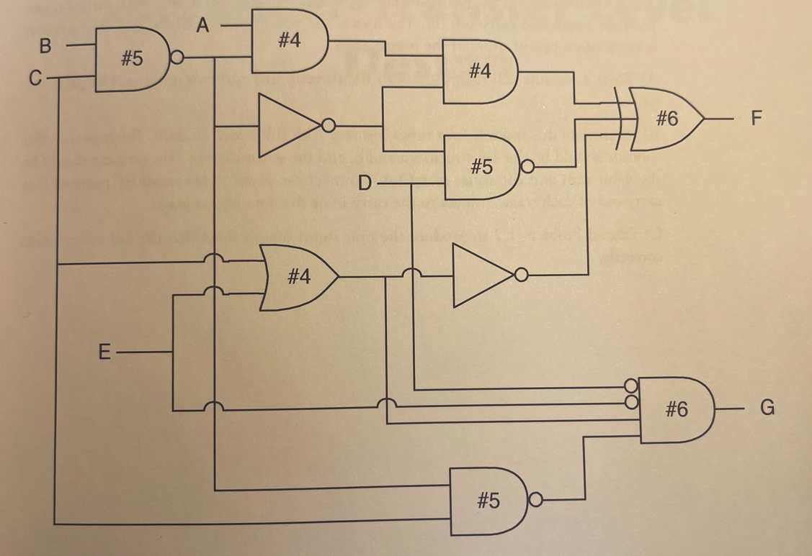
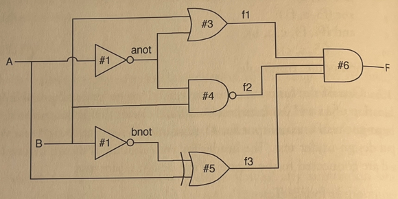

# 1.6 Exercise Problems - Tutorial
### 1.1 For the following SystemVerilog module, what is the simplified Boolean expression for the output?

```sv
module trueBoole
    (output logic f,
    input logic a, b, c);

    nor (f, f1, f2, f5);

    or  (f2, f3, f4, f5);
    not (f1, a);
    xor (f3, a, f1);
    and (f4, f3, c, a, b),
        (f5, a, c);
endmodule: trueBoole
```

### 1.2 One of the functions of a testbench is to generate all possible input patterns (combination of 1s and 0s) for a combinational circuit that is being tested. Each pattern should be on the testbench output for #1 time unit. Write a testbench that will do this for a 4-input design-under-test. The header for your module is shown below. Imagine that outputs a-d are connected to the inputs of the design under test.

```sv
module fourBitTest
    (output logic a, b, c, d);
```
### 1.3. Write a structural SystemVerilog module to describe this circuit.


### 1.4 Extend your solution of Problem 1.2 to test Problem 1.3.

### 1.5 What are the 4-valued logic characteristics of a 2-input NOR gate (as used in SystemVerilog)? Write a SystemVerilog module and testbench to produce a 4-valued truth table. Use a `$display` statement to print each line of the truth table.

### 1.6 The following circuit is driven by the initial block shown.


```sv
logic A, B;
initial begin
A= 0;
B = 1;
#15 A=1;
B = 0;
#15 $finish;
end
```

> Draw a timing diagram for the circuit that starts at time 0 and continues until all signals
have settled to their final values.

### 1.7 A full adder is a logic circuit that will add two binary input bits and a carry-in, and produce a sum and carry-out bit. The sum is the XOR of the three bits, and the carry-out is TRUE when two or more of the inputs are 1.
- A) Write a module called fullAdd with the three inputs and two outputs. Use primitive
gates.
- B) Instantiate this module four times inside a 4-bit full adder module. The inputs to this
module should be the 4-bit vectors a and b, and the scalar carryIn. The outputs should be
the 4-bit sum and the scalar carryOut. Connect the instantiated modules' ports so that
carry out of each stage connect to the carry in or the next higher stage.
- C) Extend Problem 1.2 to produce the nine input bits to show that the full adder works
correctly.