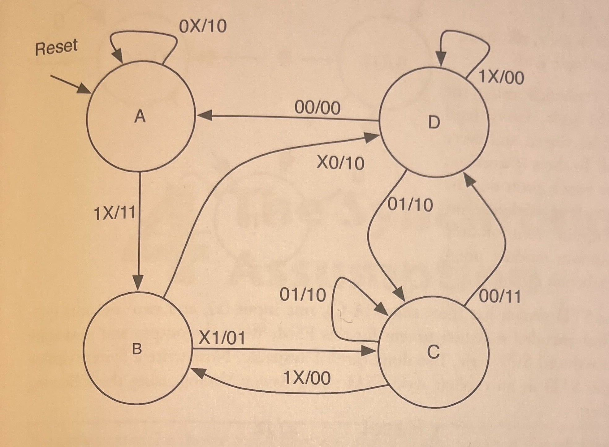
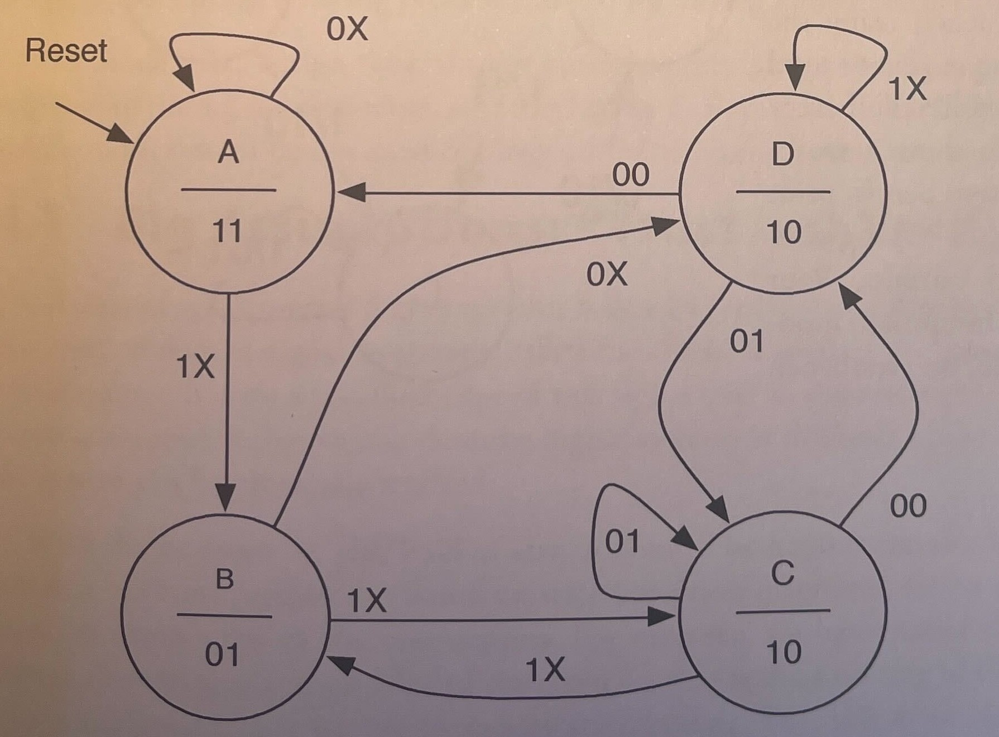
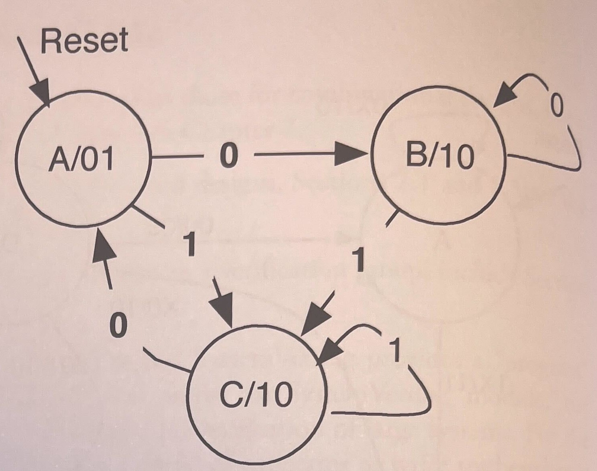
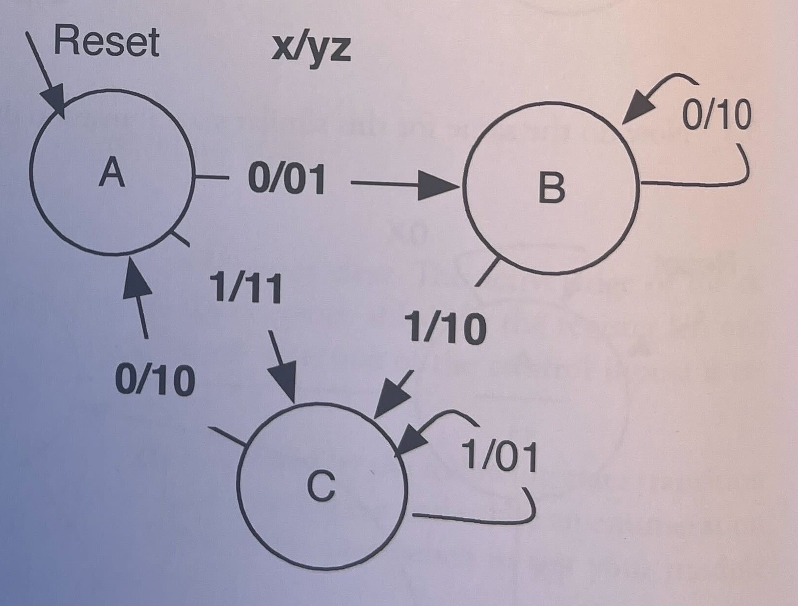

#  3.6 Exercise Problems - Sequential Logic

### 3.1 Write and simulate a model of an 8-bit register with the following module header:

```verilog
module reg WithBenefits
#(parameter W = 8)
(input logic [W-1:0]
input logic
output logic [W-1:0]
```

rstN is an asynchronous clear, and clr is a synchronous clear. The active edge of the ck
is the positive edge. Id loads the register from the d inputs. shl shifts the register left one
place, shifting shIn into the low order bit. If more than one of the control inputs is as-
serted, the order of precedence is clr, ld, and shl.

### 3.2 Write a System Verilog module for the FSM defined by the following state transition diagram. 
The input ordering is i and j. The output ordering is x and y. Use an enumeration to define the state names. Write an explicit FSM. Write a testbench to test your module using an implicit FSM. The module header is:

```verilog
module FSMprob
(input logic clk, rstN, i, j,
output logic x, y);
```



### 3.3 Now do the same for this similar state transition diagram.



### 3.4 



#### A. The following STD has three states (A-C), one input (x), and two outputs (yz).
Specify an output-encoded state assignment for this FSM. Write the output and next-
state equations in reduced SOP style. Use don't cares if available. From these, write a
System Verilog model for the STD using the module declaration:

#### B. Write a testbench using the implicit FSM style. 
very legal state should be visited and every arc traversed. To show it working, have the test bench print out the current state along with the in- puts and outputs. Your module should instantiate module p3_4 inside the testbench module.

### 3.5



####  A. The STD shown has three states (A-C), one input (x), and two outputs (yz).
Specify a 1-hot-encoded state assignment for this FSM. Write the output and next-state
equations in reduced SOP style. Use don't cares if available. Now write a System Verilog
model for the STD as an explicit style FSM using SystemVerilog using the following
module header:

```verilog
module p3_5
(input logic x, clk, reset,
output logic y, z);
```

#### B. Write a testbench using the implicit FSM style. 
Every legal
state should be visited and every
arc traversed. To show it working, have the test bench print
out the current state along with
the inputs and outputs. Your
module should instantiate mod-
ule p3_4 inside the testbench
module.