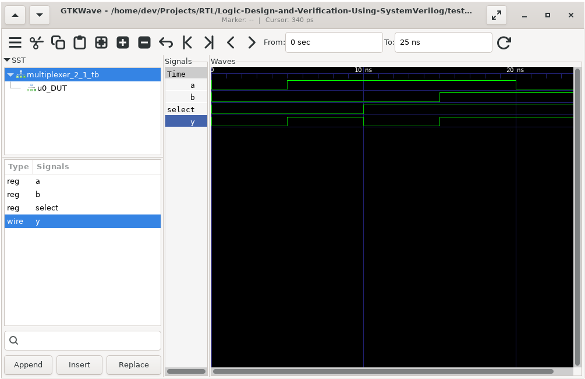
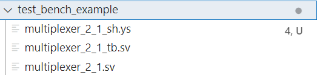
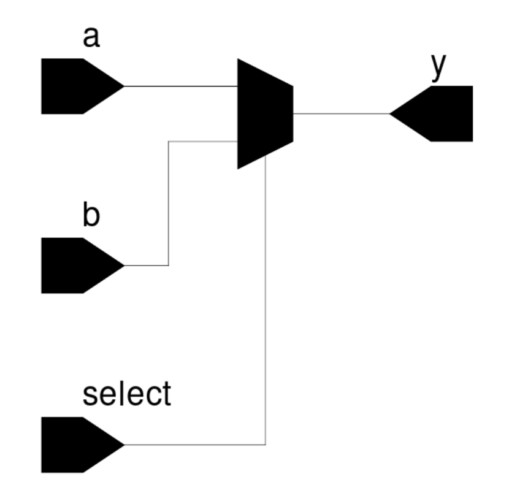

# Logic Design and Verification Using SystemVerilog

This repository contains my solutions and practical implementations while studying "Logic Design and Verification Using SystemVerilog". I'm documenting my learning journey and implementations of the concepts from the book.

## Structure

Each directory corresponds to specific chapters or topics, containing:
- Source code (`.sv` files)
- Testbenches
- Documentation
- Simulation outputs

## SystemVerilog Simulation Script

> Compile -> Run Simulation -> Open Waveform viewer

A bash script for compiling and simulating SystemVerilog files using Icarus Verilog and GTKWave.

### Features
- Automatic compilation of SystemVerilog source and testbench files
- VCD waveform generation and viewing
- Automatic cleanup of generated files
- Error handling and input validation

### Usage

Install dependencies (Ubuntu/WSL):
```bash
./configure
```

Create 2 files:
 - `source_file.sv`
 - `source_file_tb.sv`

and add this to your `initial` block:
```sv
 initial begin
    $dumpfile("source_file_tb.vcd");
    $dumpvars(0,source_file_tb);
    ...
 end
```

Run the script:
```bash
./run_simulation test_bench_example/<source_file>
```

This will result opening waveform viewer:


## Create Schematics Diagram

> Synthesis done with `yosys`

Create `Yosys` script file with name `source_file_sh.ys`:

```bash
# Read the SystemVerilog file
read_verilog -sv test_bench_example/multiplexer_2_1.sv

# Perform synthesis
synth -top multiplexer_2_1

# Write the netlist to a file
write_json multiplexer_2_1.json

# Generate the schematic
#show -format dot -prefix multiplexer_2_1
```

So you have following structure:



Synthesize and Generate Schematics: 

```bash
./generate_schematic test_bench_example/multiplexer_2
_1_sh.ys
```

Create Diagram:

```bash
./create_diargam multiplexer_2_1.json
```

This will result in creating a schematic diagram:

